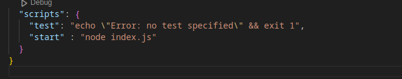

---

<br>

# `**01 Introduction of Node JS:**`

<br>

---

Node.js একটি ওপেন সোর্স, ক্রস-প্ল্যাটফর্ম রানটাইম এনভায়রনমেন্ট, যা জাভাস্ক্রিপ্ট চালানোর জন্য ব্যবহৃত হয়। এটি Chrome V8 জাভাস্ক্রিপ্ট ইঞ্জিনের উপর ভিত্তি করে তৈরি এবং মূলত সার্ভার-সাইড অ্যাপ্লিকেশন ডেভেলপমেন্টের জন্য ব্যবহৃত হয়।  
Node.js-এর মাধ্যমে আমরা ব্রাউজারের বাইরে জাভাস্ক্রিপ্ট কোড রান করতে পারি। এটি স্কেলেবল, দ্রুত, এবং ইভেন্ট-ড্রিভেন আর্কিটেকচারের কারণে রিয়েল-টাইম অ্যাপ্লিকেশন যেমন চ্যাট অ্যাপ বা লাইভ স্ট্রিমিং অ্যাপ্লিকেশন তৈরির জন্য খুব জনপ্রিয়।


---

<br>

# `02 **Node.js এবং Browser-এর মধ্যে পার্থক্য:**`

<br>


| **বিষয়**               | **Node.js**                                                                 | **Browser**                                                                 |
|--------------------------|-----------------------------------------------------------------------------|-----------------------------------------------------------------------------|
| **জাভাস্ক্রিপ্ট রানটাইম** | Node.js সার্ভার-সাইডে জাভাস্ক্রিপ্ট রান করার জন্য ব্যবহৃত হয়।               | ব্রাউজার ক্লায়েন্ট-সাইডে (ইউজারের দিক) জাভাস্ক্রিপ্ট রান করার জন্য ব্যবহৃত হয়। |
| **গ্লোবাল অবজেক্ট**     | Node.js-এ `global` অবজেক্ট ব্যবহৃত হয়।                                     | ব্রাউজারে `window` বা `document` গ্লোবাল অবজেক্ট ব্যবহার করা হয়।            |
| **মডিউল সিস্টেম**       | Node.js-এ CommonJS মডিউল সিস্টেম (`require`) ব্যবহার করা হয়।               | ব্রাউজারে ES মডিউল সিস্টেম (`import/export`) ব্যবহার করা হয়।               |
| **API Access**          | ফাইল সিস্টেম, OS মডিউল, এবং নেটওয়ার্ক সিস্টেমের অ্যাক্সেস রয়েছে।           | ব্রাউজার শুধুমাত্র DOM এবং HTTP রিকোয়েস্টের অ্যাক্সেস দেয়।                 |
| **ইভেন্ট লুপ**          | Node.js-এ ইভেন্ট-লুপ ব্যবহার করে নন-ব্লকিং অপারেশন চালায়।                   | ব্রাউজার ইভেন্ট-লুপ ব্যবহার করে UI আপডেট এবং ইউজার ইন্টারঅ্যাকশন পরিচালনা করে। |
| **ব্যবহার**             | সার্ভার-সাইড অ্যাপ্লিকেশন, API, বা CLI টুল তৈরির জন্য ব্যবহৃত হয়।            | ওয়েব পেজ ইন্টারেকশন এবং UI ডেভেলপমেন্টের জন্য ব্যবহৃত হয়।                  |

---

**উদাহরণ:**
1. Node.js ব্যবহার করে আপনি সার্ভার তৈরি করতে পারেন:
```javascript
   const http = require('http');
   const server = http.createServer((req, res) => {
       res.end('Hello from Node.js!');
   });
   server.listen(3000, () => {
       console.log('Server is running on port 3000');
   });
```

2. ব্রাউজারে সাধারণ জাভাস্ক্রিপ্ট:
```javascript
   console.log('Hello from the Browser!');
   alert('This is running in the browser!');
```

<br>


---

<br>

# `03 **Crate a package.json file with "npm init" **`

<br>

**Command:**

```bash 
    npm init
```

In `package.json` file: 




```bash 
    "start" : "node node.js"
```

<br>

- `As, Key we have to give "start" `

- `If we add this line then, when ever we run "npm start" it will execute the node.js file.`

- `Run a specific file: "npm index.js"`


<br>


---

<br>

# `04 **Always run a file with Nodemon:**`

<br>

`সাধারণত, Node.js অ্যাপ্লিকেশন চালানোর সময় কোডে পরিবর্তন করলে আপনাকে প্রতিবার ম্যানুয়ালি সার্ভার বন্ধ করে আবার চালু করতে হয়। কিন্তু Nodemon ব্যবহার করলে এটি স্বয়ংক্রিয়ভাবে আপনার কোডের পরিবর্তন ডিটেক্ট করে এবং সার্ভারকে রিস্টার্ট করে দেয়।`

আপনি Nodemon একটি নির্দিষ্ট প্রজেক্টের জন্য ইনস্টল করতে চাইলে, এটি **লোকাল ইনস্টলেশন** করতে হবে। নিচে ধাপে ধাপে নির্দেশনা দেওয়া হলো:

---

### **Step 1: লোকাল ইনস্টলেশন**
আপনার প্রজেক্ট ডিরেক্টরিতে যান এবং### **Step 3: Nodemon রান করুন**
আপনার অ্যাপ্লিকেশন চালানোর জন্য নিচের কমান্ডটি ব্যবহার করুন:

```bash
npm run start
```

এটি Nodemon দিয়ে আপনার অ্যাপ্লিকেশন চালাবে এবং আপনার ফাইলে কোনো পরিবর্তন হলে স্বয়ংক্রিয়ভাবে সার্ভার রিস্টার্ট করবে।

---

### **Step 4: Nodemon ইনস্টল চেক করুন**
ইনস্টলেশন সঠিক হয়েছে কিনা দেখতে, আপনার প্রজেক্ট ডিরেক্টরির **`node_modules/.bin`** ফোল্ডারে **nodemon** কমান্ড রয়েছে কিনা যাচাই করুন।

```bash
ls node_modules/.bin
```

---

### **লোকাল ইনস্টলেশন কেন ব্যবহার করবেন?**
1. **এক্সপ্লিসিট ডিপেনডেন্সি:** প্রজেক্টের নির্দিষ্ট ডিপেনডেন্সি আলাদা রাখতে সাহায্য করে।
2. **কম কনফ্লিক্ট:** গ্লোবাল ইনস্টলেশনের কারণে কোনো সমস্যা বা ভার্সন কনফ্লিক্ট হয় না।
3. **কোড শেয়ারিং সহজ:** অন্য কেউ আপনার প্রজেক্ট ক্লোন করলে তারাও Nodemon লোকালি পাবে। 

---

### **উপসংহার**
Nodemon-কে একটি নির্দিষ্ট প্রজেক্টে ইনস্টল করে `npm run` কমান্ডের মাধ্যমে খুব সহজে ব্যবহার করতে পারেন। এটি প্রজেক্টের মধ্যে ডেভেলপমেন্ট সহজ এবং ম্যানেজেবল রাখে। 
 নিচের কমান্ডটি রান করুন:

```bash
npm install nodemon --save-dev
```
- **`--save-dev`:** এটি Nodemon-কে প্রজেক্টের ডেভেলপমেন্ট ডিপেনডেন্সি হিসেবে ইনস্টল করবে।

`dev আমাদের package.json ফাইলে, devDependencies key এর ভ্যালু গুলোর মধ্যে nodemon দেখতে পারবো ।`

---

### **Step 2: প্যাকেজ স্ক্রিপ্ট তৈরি করুন**
একটি প্রজেক্টে Nodemon ব্যবহারের জন্য আপনার **`package.json`** ফাইলে একটি স্ক্রিপ্ট যুক্ত করুন।

**উদাহরণ:**
`package.json` ফাইলে নিচের মতো স্ক্রিপ্ট যোগ করুন:

```json
"scripts": {
  "start": "nodemon app.js"
}
```

## `**Existing form the nodemon:**`

-> crt+c
-> `Progamatically we use process module.`
-> process.exit(1) or  <br>
-> process.exit = 1
<br>

---

<br>

# `05 **Read environment variables:**`

<br>

Node.js-এ **environment variables** পড়া অত্যন্ত গুরুত্বপূর্ণ কারণ এটি আমাদের অ্যাপ্লিকেশনকে আরো **ডাইনামিক**, **নিরাপদ**, এবং **পোর্টেবল** করে তোলে। নিচে বাংলা ভাষায় এর প্রয়োজনীয়তার বিস্তারিত ব্যাখ্যা দেওয়া হলো:


### **Environment Variable কি?**
Environment variable হলো সিস্টেম-লেভেলের কিছু তথ্য যা আপনার অ্যাপ্লিকেশন রান করার সময় ব্যবহার করে। এটি সাধারণত কনফিগারেশন সেটিংস সংরক্ষণ করতে ব্যবহৃত হয়, যেমন:
- ডাটাবেজ কানেকশন স্ট্রিং
- API কী (API Key)
- সার্ভারের পোর্ট নম্বর
- তৃতীয় পক্ষের সার্ভিসের তথ্য
- ডিপ্লয়মেন্ট মোড (Development, Production ইত্যাদি)

### **কেন Environment Variable ব্যবহার করবেন?**
#### 1. **গোপন তথ্য সুরক্ষিত রাখা**  
#### 2. **ডাইনামিক কনফিগারেশন**  
#### 3. **কোড শেয়ারিং সহজ করা**  
#### 4. **একাধিক পরিবেশে কাজ করা সহজ করা**  
#### 5. **DevOps এবং CI/CD সিস্টেমে সহজ ইন্টিগ্রেশন**  


`**Give enviromnet value in terminal**`

```bash
Name=yasin Profession=Developer node env.js 
```

**For receving this in env.js file:**
```js
Name = process.env.Name
Profession = process.env.Profession
```

### `Read environment file from .env file: `

- 1st make a .env file.
- Using 'dotenv' module fetch the data.
- just add: `require("dotenv).config();`


---

<br>

# `06 **repl (read evaluate print loop):**`


<br>

REPL (Read-Evaluate-Print Loop) হলো একটি ইন্টার‍্যাক্টিভ প্রোগ্রামিং পরিবেশ, যা ব্যবহারকারীকে কোড লেখার, তাৎক্ষণিকভাবে তা এক্সিকিউট করার এবং ফলাফল দেখার সুবিধা দেয়। Node.js-এ REPL ব্যবহার করা খুব সহজ।

**Node.js REPL শুরু করার জন্য নিচের ধাপগুলো অনুসরণ করতে হবে:**

1. **Node.js REPL চালু করা (কমান্ড লাইন থেকে):**  
   শুধু টার্মিনালে `node` লিখে এন্টার প্রেস করলেই Node.js এর ডিফল্ট REPL চালু হবে।

2. **কাস্টম REPL তৈরি করা (কোডের মাধ্যমে):**

```javascript
const repl = require("repl");  // REPL মডিউল ইমপোর্ট করা হচ্ছে

repl.start('$ ');  // কাস্টম প্রম্পট চিহ্ন দিয়ে REPL শুরু করা হচ্ছে
```

**ব্যাখ্যা:**

- `const repl = require("repl")`:  
  এটি Node.js এর বিল্ট-ইন `repl` মডিউল ইমপোর্ট করছে যা REPL পরিবেশ তৈরি করতে সাহায্য করে।

- `repl.start('$ ')`:  
  এটি REPL শুরু করছে এবং প্রম্পট হিসেবে `$` দেখাচ্ছে। অর্থাৎ, যেখানে আপনি ইনপুট দেবেন সেখানে `$` চিহ্নটি দেখাবে।

**উদাহরণ আউটপুট:**

```bash
$ 2 + 2
4
$ console.log("হ্যালো, world!")
হ্যালো, world!
undefined
$ 
```


---
<br>

# `07 **Take the value of argumnet:**`

<br>

- With `process.argv`
- With `minimist` (node argment.s --argument)


---
<br>

# `08 **Format the output:**`

<br>

-  %s 
-  %d 
-  %i
-  %o
- console.clear()
- console.count("String")
- console.countReset("String") // string should be same to reset the count.

✅ 1. console.trace() এর কাজ কী?
  -  এটি এমনভাবে কাজ করে যেন আমরা জানতে পারি "এই লাইনে এক্সিকিউশন কীভাবে এল?"
  -  এটি ফাংশন কলের একটি স্ট্যাক ট্রেস দেখায়, যা জানায় কোন ফাংশন থেকে কোন ফাংশন কল করা হয়েছে।

✅ 2. ```js npm install progress``` progress bar

✅ 3. ```js npm install chalk ```  change text color in the console


---

<br>

# `09 **Format the input:**`

<br>

- ```js npm install readline``` take user input with readline
- ```js npm install prompt-sync ``` take user input promt-sync


